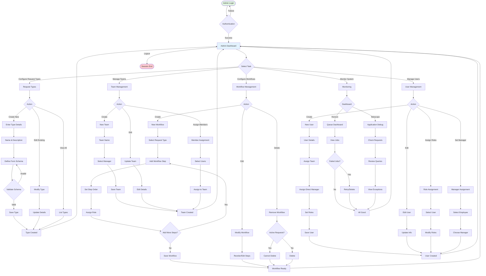
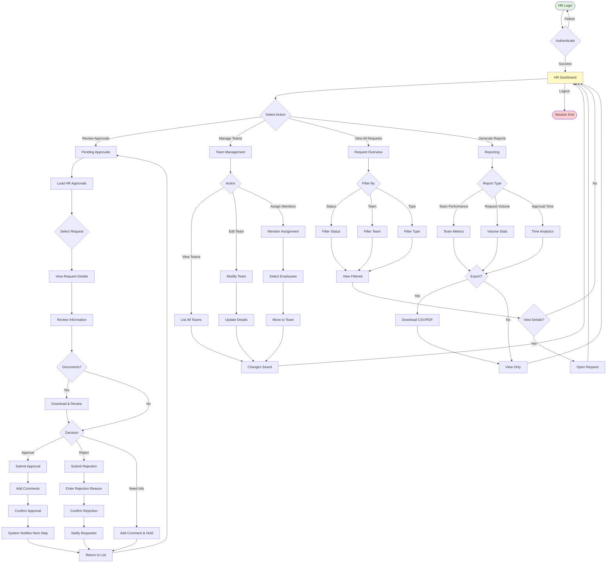
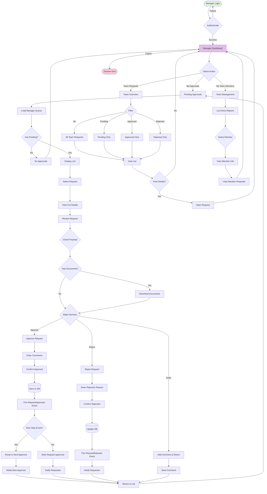
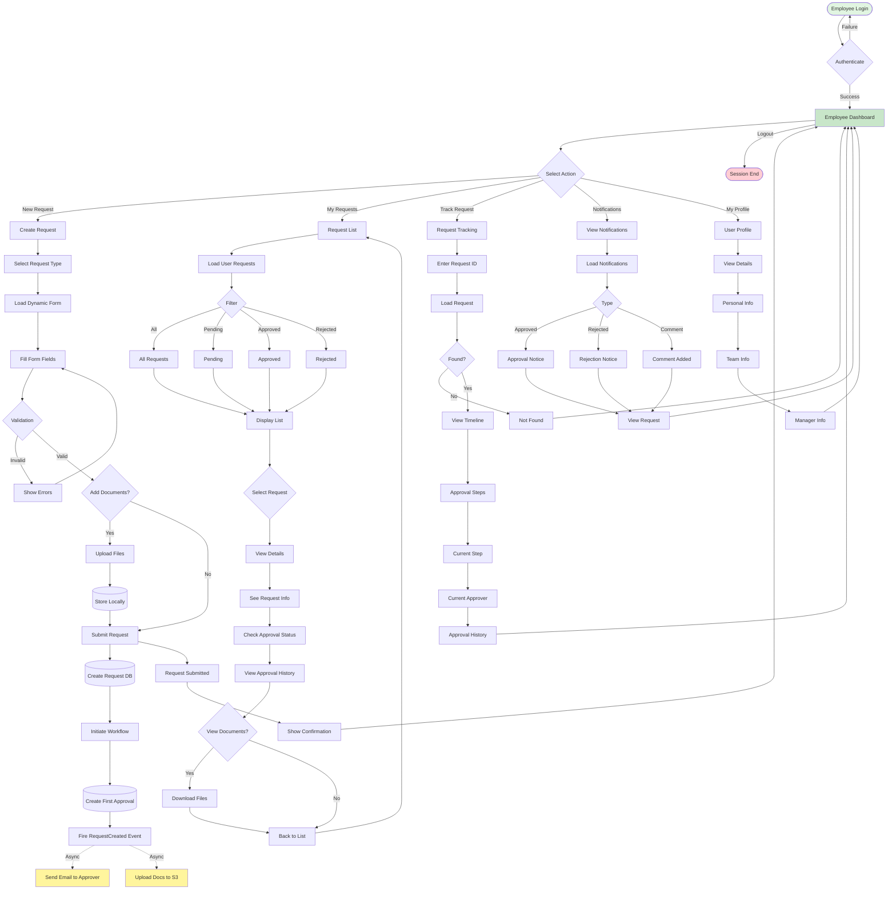
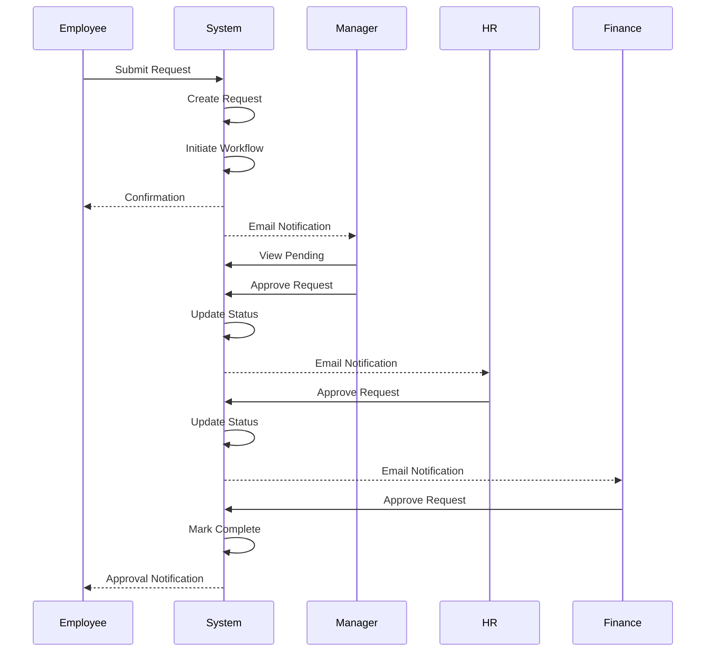
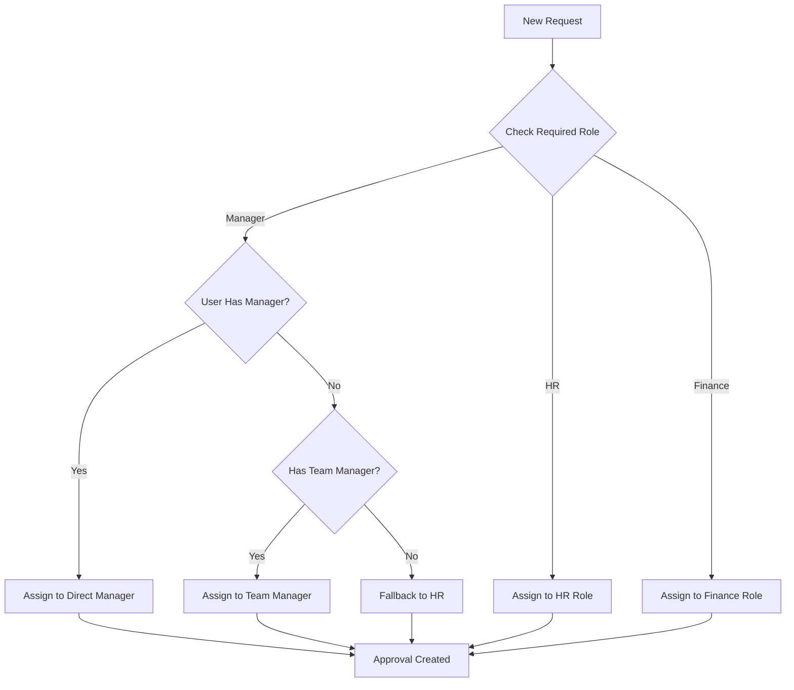

# User Journeys - FlowManager

Complete user journey flows for all system roles in FlowManager.

---

## Table of Contents

1. [Admin Journey](#1-admin-journey)
2. [HR Journey](#2-hr-journey)
3. [Manager Journey](#3-manager-journey)
4. [Employee Journey](#4-employee-journey)

---

## 1. Admin Journey

### Overview
Admins have full system access and are responsible for configuration, user management, and system monitoring.

### Admin Flowchart

### Admin Capabilities

| Task | Description | Outcome |
|------|-------------|---------|
| **Request Type Creation** | Define new request categories with custom form schemas | New request types available to users |
| **Workflow Configuration** | Build multi-step approval processes | Automated routing of requests |
| **Team Management** | Organize users into teams with managers | Hierarchical structure |
| **User Administration** | Create, edit, and manage user accounts | User access control |
| **Role Assignment** | Grant permissions via role assignment | Authorization control |
| **System Monitoring** | Track application health and job queues | Proactive issue resolution |

---

## 2. HR Journey

### Overview
HR personnel handle human resources requests, manage team structures, and serve as fallback approvers.

### HR Flowchart

### HR Responsibilities

| Responsibility | Actions | Impact |
|----------------|---------|--------|
| **Approval Processing** | Review and approve/reject HR-level requests | Request progression |
| **Team Organization** | Manage team structures and assignments | Organizational hierarchy |
| **Fallback Approver** | Approve requests when managers are unavailable | Workflow continuity |
| **Reporting** | Generate analytics on team and request metrics | Data-driven decisions |
| **User Support** | Assist employees with request-related issues | User satisfaction |

---

## 3. Manager Journey

### Overview
Managers approve requests from their team members and manage direct reports.

### Manager Flowchart

### Manager Responsibilities

| Responsibility | Actions | Impact |
|----------------|---------|--------|
| **Request Approval** | Review and approve/reject team requests | Workflow progression |
| **Team Oversight** | Monitor team member requests | Team performance tracking |
| **Direct Report Management** | Manage direct reports hierarchy | Organizational structure |
| **Timely Processing** | Ensure quick turnaround on approvals | Employee satisfaction |

---

## 4. Employee Journey

### Overview
Employees submit requests and track their progress through the approval workflow.

### Employee Flowchart

### Employee Capabilities

| Capability | Actions | Outcome |
|-----------|---------|---------|
| **Request Submission** | Create and submit requests via dynamic forms | Request enters workflow |
| **Document Upload** | Attach supporting documents | Evidence for approvers |
| **Request Tracking** | Monitor approval progress in real-time | Transparency |
| **Notification Receipt** | Receive updates on request status | Timely information |
| **History Review** | View past requests and decisions | Record keeping |

---

## User Journey Comparison

| Feature | Admin | HR | Manager | Employee |
|---------|-------|----|---------| |
| **Create Requests** | ❌ | ✅ | ✅ | ✅ |
| **Approve Requests** | ❌ | ✅ | ✅ | ❌ |
| **Configure Workflows** | ✅ | ❌ | ❌ | ❌ |
| **Manage Users** | ✅ | ✅ (Limited) | ❌ | ❌ |
| **Manage Teams** | ✅ | ✅ | ✅ (View) | ❌ |
| **System Monitoring** | ✅ | ❌ | ❌ | ❌ |
| **View All Requests** | ✅ | ✅ | ✅ (Team) | ✅ (Own) |
| **Generate Reports** | ✅ | ✅ | ✅ (Team) | ❌ |

---

## Key Interaction Patterns

### Request Lifecycle Interaction

### Hierarchical Approver Selection

---

## Conclusion

Each role in FlowManager has a distinct journey optimized for their responsibilities:

- **Admins** focus on system configuration and oversight
- **HR** handles organizational management and serves as fallback approvers
- **Managers** process team requests efficiently
- **Employees** have a streamlined submission and tracking experience

The workflows are designed to ensure:
- ✅ **Clear Separation of Concerns**
- ✅ **Efficient Approval Routing**
- ✅ **Transparent Progress Tracking**
- ✅ **Automated Notifications**
