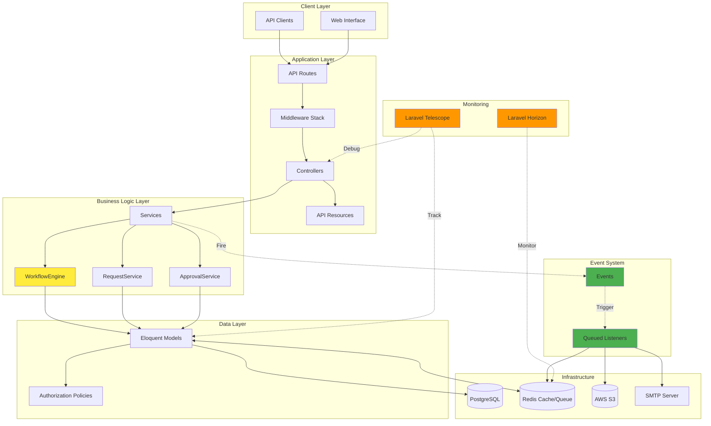
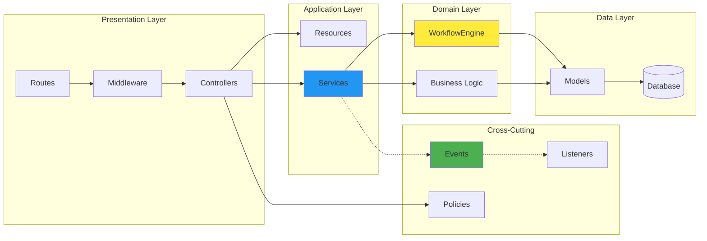
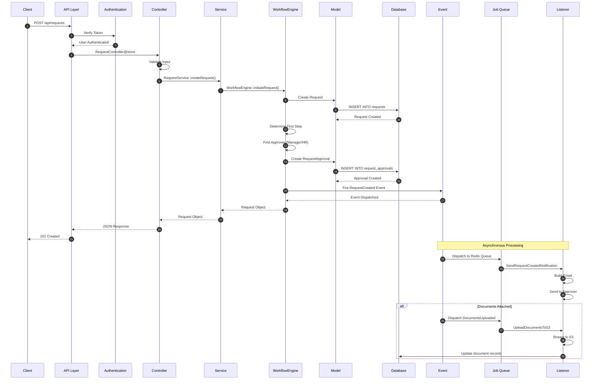
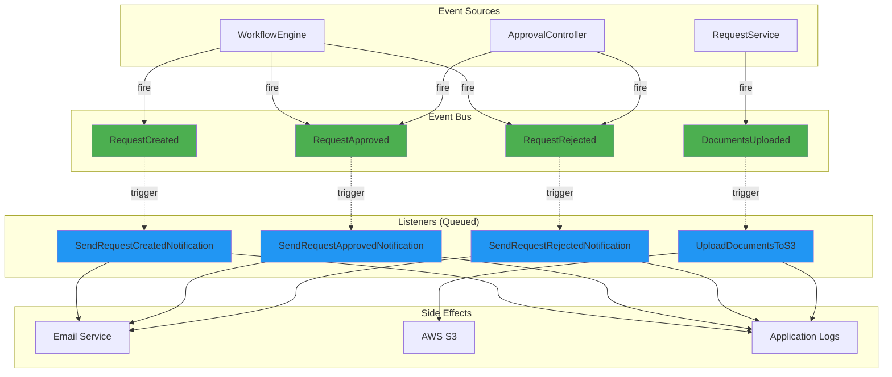
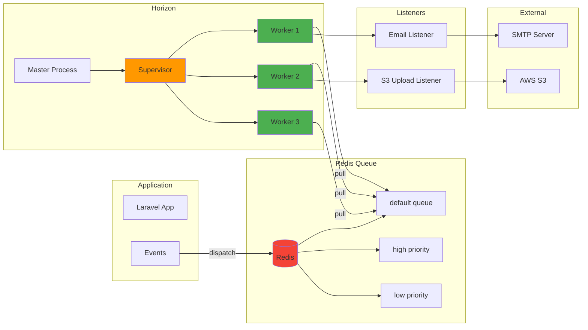
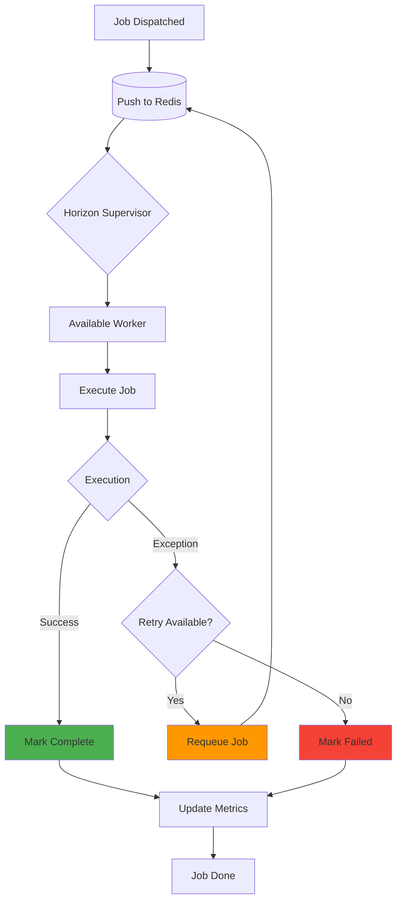
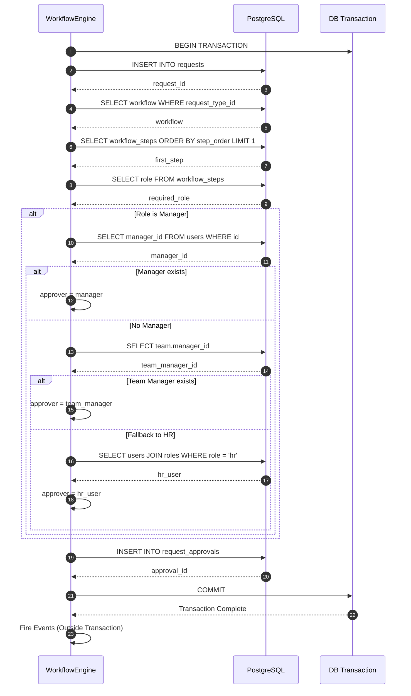
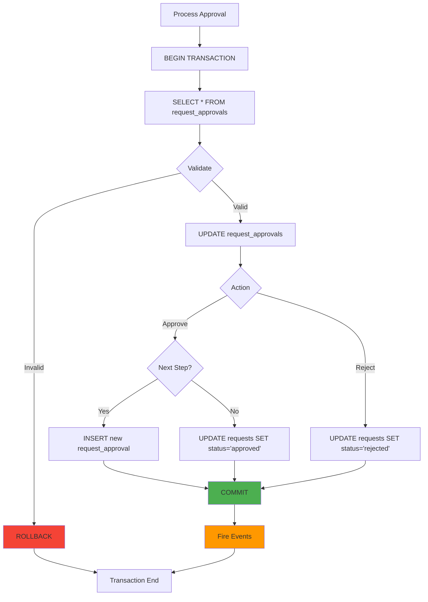
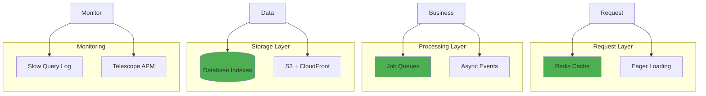

# System Architecture Flow - FlowManager

Comprehensive overview of system architecture, component interactions, and technical flow patterns.

---

## Table of Contents

1. [High-Level Architecture](#1-high-level-architecture)
2. [Application Layers](#2-application-layers)
3. [Request Processing Flow](#3-request-processing-flow)
4. [Event-Driven Architecture](#4-event-driven-architecture)
5. [Background Job Processing](#5-background-job-processing)
6. [Database Transaction Flow](#6-database-transaction-flow)

---

## 1. High-Level Architecture

###  System Overview

---

## 2. Application Layers

### Layer Interaction Flow

### Layer Responsibilities

| Layer | Components | Responsibilities |
|-------|-----------|------------------|
| **Presentation** | Routes, Middleware, Controllers | HTTP handling, authentication, input validation |
| **Application** | Services, Resources | Business orchestration, data transformation |
| **Domain** | WorkflowEngine, Business Logic | Core business rules, workflow execution |
| **Data** | Models, Repositories | Data persistence, retrieval, relationships |
| **Cross-Cutting** | Events, Policies, Logging | Asynchronous operations, authorization, observability |

---

## 3. Request Processing Flow

### Complete Request Lifecycle

### Step-by-Step Breakdown

1. **Client Request** - HTTP request with payload
2. **Authentication** - Sanctum token validation
3. **Input Validation** - Request rules validation
4. **Service Invocation** - Business logic delegation
5. **Workflow Initiation** - WorkflowEngine orchestration
6. **Database Write** - Request and approval creation
7. **Event Dispatch** - Fire RequestCreated event
8. **Synchronous Response** - Immediate API response
9. **Async Processing** - Queue job execution
10. **Email Delivery** - Background notification
11. **S3 Upload** - Document storage (if applicable)

---

## 4. Event-Driven Architecture

### Event Bus Pattern

### Event Flow Characteristics

| Aspect | Implementation |
|--------|---------------|
| **Pattern** | Observer (Pub/Sub) |
| **Coupling** | Loosely coupled |
| **Execution** | Asynchronous via queues |
| **Reliability** | Retry mechanism (Horizon) |
| **Scalability** | Horizontal scaling via workers |
| **Monitoring** | Horizon dashboard |

---

## 5. Background Job Processing

### Horizon Queue Architecture

### Job Processing Flow

---

## 6. Database Transaction Flow

### Request Creation Transaction

### Approval Processing Transaction

---

## Architecture Patterns

### Design Patterns Used

| Pattern | Implementation | Purpose |
|---------|---------------|---------|
| **Service Layer** | `WorkflowEngine`, `RequestService` | Business logic encapsulation |
| **Repository** | Eloquent Models | Data abstraction |
| **Observer** | Laravel Events/Listeners | Decoupled notifications |
| **Strategy** | Workflow Steps with Roles | Pluggable approval logic |
| **Factory** | Request creation with types | Dynamic object creation |
| **Chain of Responsibility** | Multi-step approval flow | Sequential processing |
| **Queue** | Redis with Horizon | Async job processing |

### Key Architectural Decisions

1. **Event-Driven for Side Effects**
   - Emails and uploads don't block main flow
   - Better scalability and resilience

2. **Service Layer Abstraction**
   - Controllers stay thin
   - Business logic testable and reusable

3. **WorkflowEngine Centralization**
   - Single source of truth for workflow logic
   - Easier maintenance and debugging

4. **Eloquent ORM**
   - Rapid development
   - Built-in relationships and caching

5. **Redis for Cache & Queue**
   - Fast in-memory operations
   - Pub/sub for real-time features

6. **S3 for Document Storage**
   - Scalable and durable
   - Offloads storage from app servers

---

## Performance Considerations

### Optimization Strategies

| Strategy | Impact |
|----------|--------|
| **Eager Loading** | Reduces N+1 queries |
| **Redis Caching** | 10-100x faster reads |
| **Queue Jobs** | Non-blocking responses |
| **DB Indexes** | Faster lookups |
| **S3 Streaming** | Lower memory usage |
| **Connection Pooling** | Reduced overhead |

---

## Conclusion

The FlowManager architecture is designed for:

- ✅ **Scalability** - Horizontal scaling via queue workers
- ✅ **Reliability** - Transaction safety and job retries
- ✅ **Maintainability** - Clear separation of concerns
- ✅ **Performance** - Async processing and caching
- ✅ **Observability** - Comprehensive monitoring tools
