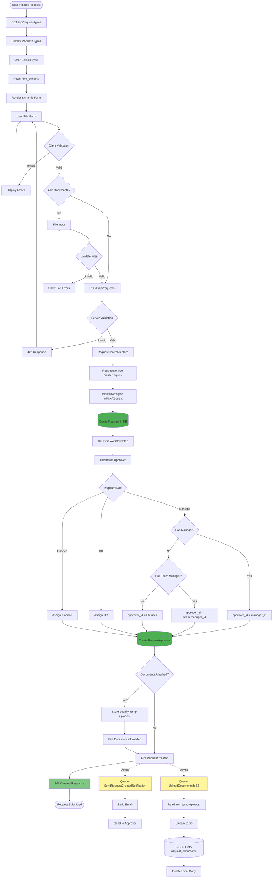
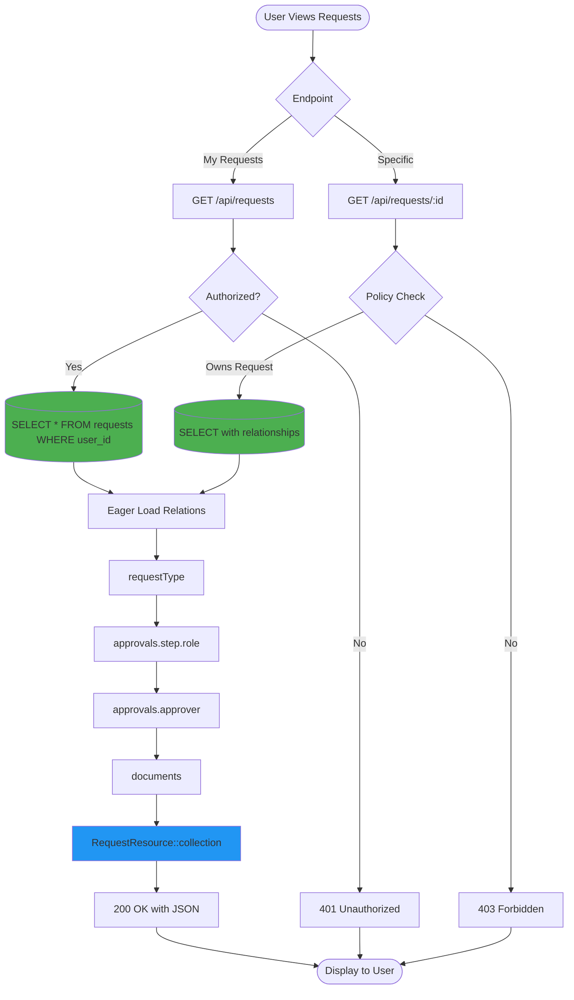
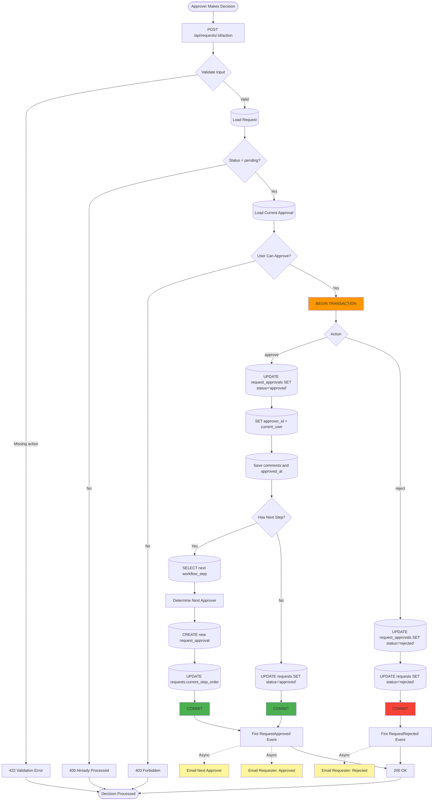
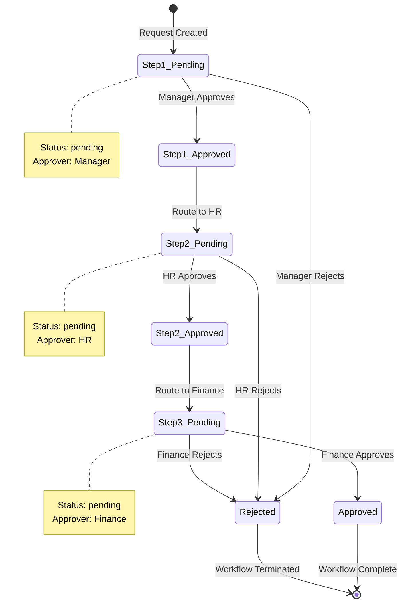
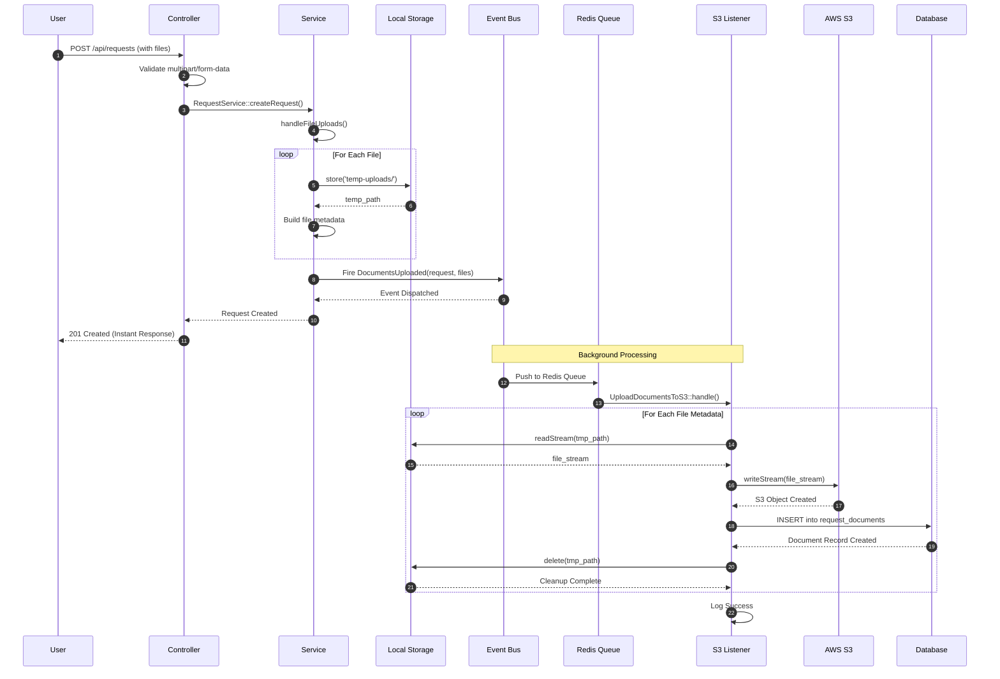
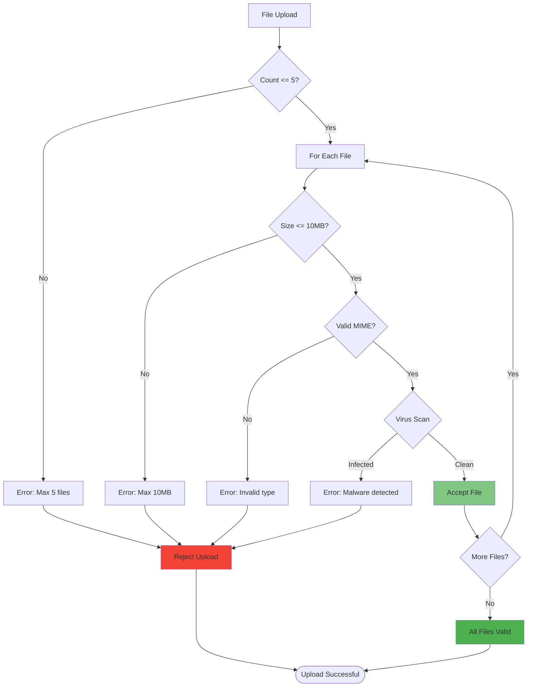
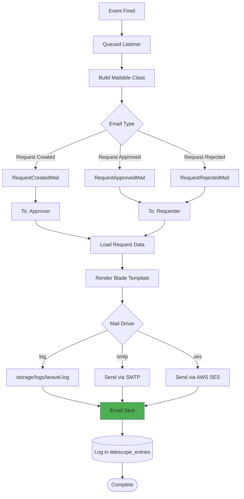
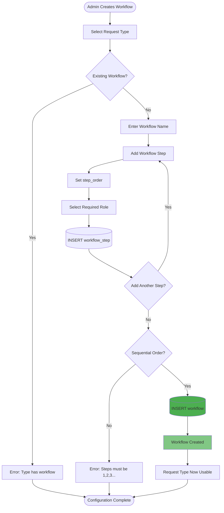
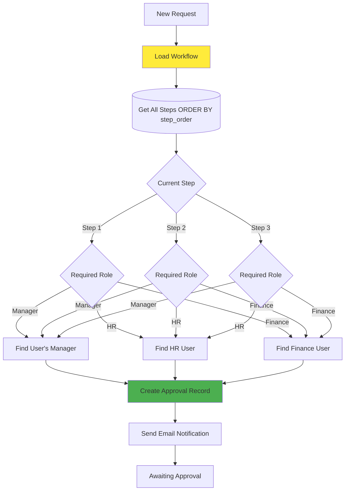

# Feature Flows - FlowManager

Detailed flows for core application features including request management, approval workflows, and document handling.

---

## Table of Contents

1. [Request Creation & Management](#1-request-creation--management)
2. [Approval Workflow Processing](#2-approval-workflow-processing)
3. [Document Upload & Storage](#3-document-upload--storage)
4. [Email Notification System](#4-email-notification-system)
5. [Workflow Configuration](#5-workflow-configuration)

---

## 1. Request Creation & Management

### Request Submission Flow

### Request Viewing Flow

---

## 2. Approval Workflow Processing

### Approval Decision Flow

### Multi-Step Workflow Example

---

## 3. Document Upload & Storage

### Two-Phase Upload Pattern

### File Validation Rules

### Supported File Types

| Category | MIME Types | Extensions |
|----------|-----------|-----------|
| **Documents** | application/pdf | .pdf |
| **Images** | image/jpeg, image/png | .jpg, .jpeg, .png |
| **Spreadsheets** | application/vnd.ms-excel, application/vnd.openxmlformats-officedocument.spreadsheetml.sheet | .xls, .xlsx |
| **Text** | text/plain, application/msword | .txt, .doc, .docx |

---

## 4. Email Notification System

### Email Dispatch Flow

### Email Templates

#### Request Created Email

**To:** Approver  
**Subject:** New Request Requires Your Approval  
**Content:**
- Request ID and Type
- Requester name
- Summary of request
- Link to approval page
- Due date (if applicable)

#### Request Approved Email

**To:** Requester  
**Subject:** Your Request Has Been Approved  
**Content:**
- Request ID and Type
- Approver name and role
- Comments (if any)
- Next steps (if workflow continues)
- Final approval notice (if complete)

#### Request Rejected Email

**To:** Requester  
**Subject:** Your Request Has Been Rejected  
**Content:**
- Request ID and Type
- Rejector name and role
- Rejection reason
- Next steps or resubmission instructions

---

## 5. Workflow Configuration

### Workflow Creation Flow

### Dynamic Workflow Routing

---

## Feature Flow Summary

### Request Lifecycle

1. **Creation** → User submits via dynamic form
2. **Validation** → Client + server validation
3. **Workflow Init** → First step determined
4. **Approver Assignment** → Based on role hierarchy
5. **Event Dispatch** → Async notifications
6. **Approval Processing** → Sequential or rejection
7. **Completion** → Final status update

### Key Performance Metrics

| Metric | Target |
|--------|--------|
| **Request Submission** | < 500ms |
| **Email Delivery** | < 30s (async) |
| **S3 Upload** | < 60s per file (async) |
| **Approval Processing** | < 300ms |
| **Workflow Transition** | < 200ms |

### Error Handling

All features implement:
- ✅ **Validation** at client and server
- ✅ **Transaction safety** for critical operations
- ✅ **Retry logic** for async jobs (3 attempts)
- ✅ **Logging** via Telescope and Laravel Log
- ✅ **User feedback** via API responses and emails

---

## Conclusion

FlowManager's feature flows prioritize:

- **User Experience** - Instant responses with background processing
- **Data Integrity** - Transaction-based state changes
- **Scalability** - Async job processing via queues
- **Observability** - Comprehensive logging and monitoring
- **Flexibility** - Dynamic forms and configurable workflows
