# Data Flow - FlowManager

Comprehensive data flow diagrams showing how information moves through the FlowManager system.

---

## Table of Contents

1. [Request State Machine](#1-request-state-machine)
2. [Data Transformations](#2-data-transformations)
3. [Information Flow Across Layers](#3-information-flow-across-layers)
4. [Queue Data Flow](#4-queue-data-flow)
5. [Database Operations](#5-database-operations)

---

## 1. Request State Machine

### Request Status Transitions

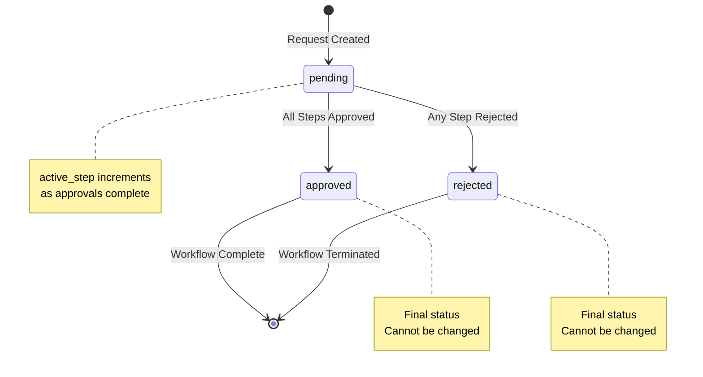

### Approval Status Transitions

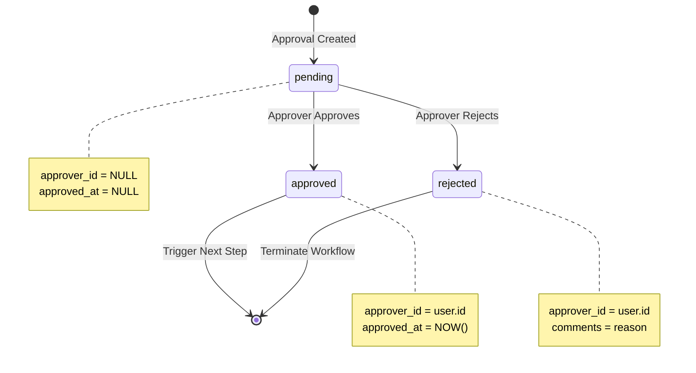

---

## 2. Data Transformations

### Request Input to Database

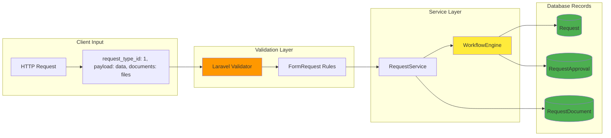

### Database to API Response

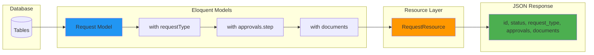

---

## 3. Information Flow Across Layers

### Complete Data Pipeline

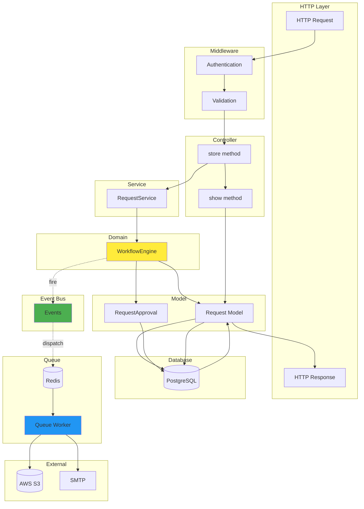

### Data Enrichment Flow

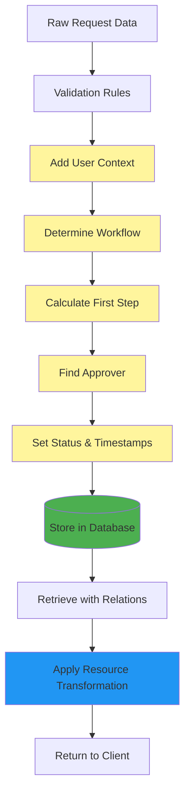

---

## 4. Queue Data Flow

### Event to Email Flow

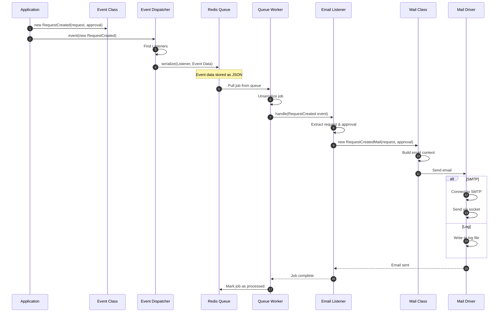

### Document Upload Flow

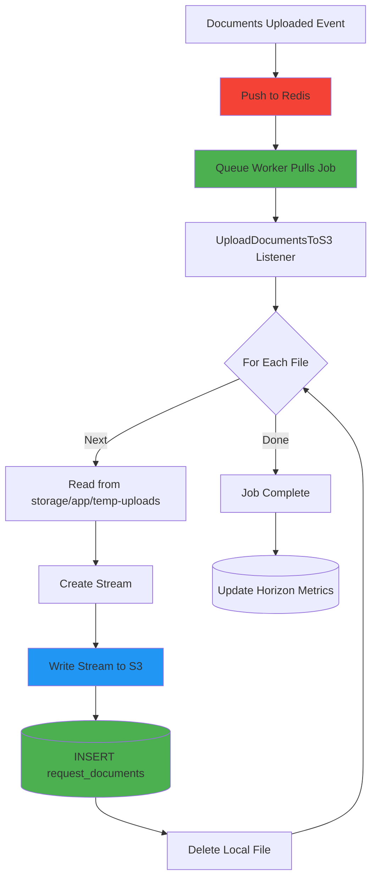

---

## 5. Database Operations

### Insert Operations

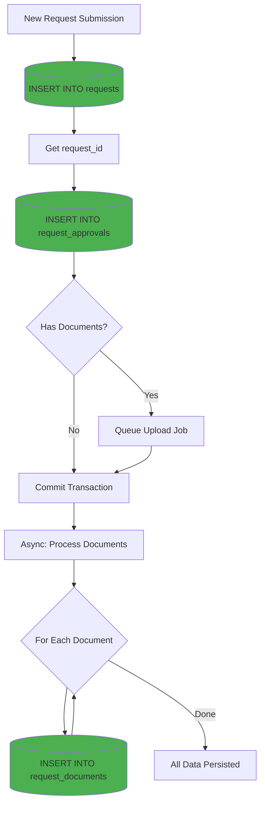

### Update Operations

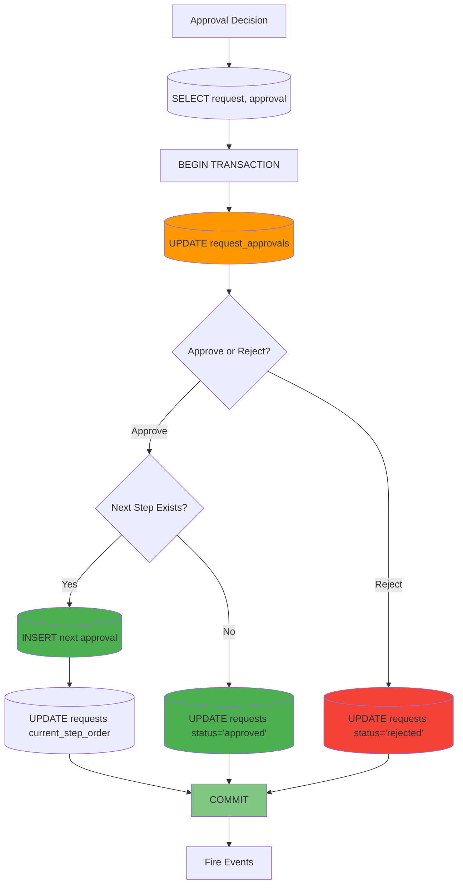

### Select Operations with Eager Loading

```mermaid
flowchart LR
    Query[GET /api/requests/:id] --> Load1[(SELECT * FROM requests WHERE id)]
    Load1 --> Load2[(SELECT * FROM request_types WHERE id)]
    Load2 --> Load3[(SELECT * FROM request_approvals WHERE request_id)]
    Load3 --> Load4[(SELECT * FROM workflow_steps WHERE id IN)]
    Load4 --> Load5[(SELECT * FROM roles WHERE id IN)]
    Load5 --> Load6[(SELECT * FROM users WHERE id IN)]
    Load6 --> Load7[(SELECT * FROM request_documents WHERE request_id)]
    Load7 --> Assemble[Assemble Object Graph]
    Assemble --> Resource[Apply Resource Transform]
    Resource --> JSON[Return JSON]
    
    style Load1 fill:#2196f3
    style Assemble fill:#ff9800
    style Resource fill:#ffeb3b
```

---

## Data Flow Patterns

### Read Pattern

1. **Controller** receives request
2. **Policy** checks authorization
3. **Model** queries database with eager loading
4. **Resource** transforms for API
5. **Response** returned as JSON

### Write Pattern

1. **Controller** validates input
2. **Service** orchestrates business logic
3. **Transaction** begins
4. **Model** persists changes
5. **Transaction** commits
6. **Event** fires for side effects

### Async Pattern

1. **Event** dispatched to queue
2. **Queue** serializes job data
3. **Worker** pulls and processes
4. **Listener** executes logic
5. **Side effect** completes (email/S3)

---

## Data Integrity

### ACID Compliance

| Property | Implementation |
|----------|---------------|
| **Atomicity** | Database transactions |
| **Consistency** | Foreign key constraints |
| **Isolation** | Row-level locking |
| **Durability** | PostgreSQL WAL |

### Validation Layers

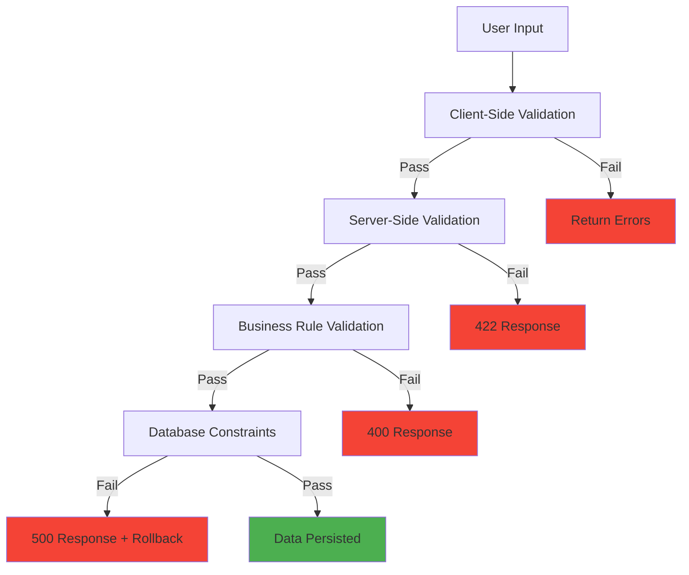

---

## Data Retention

### Archival Strategy

- **Active Requests**: Full data retention
- **Completed Requests**: Archived after 2 years
- **Telescope Data**: 7 days retention
- **Horizon Metrics**: 30 days retention
- **Log Files**: Rotated weekly

### Soft Deletes

FlowManager uses soft deletes for:
- User accounts (for audit trail)
- Teams (preserve historical references)
- Request types (maintain data integrity)

Hard deletes:
- Test data only
- GDPR compliance requests

---

## Conclusion

FlowManager's data flow is optimized for:

- ✅ **Data Integrity** - Transactions and constraints
- ✅ **Performance** - Eager loading and caching
- ✅ **Scalability** - Async processing
- ✅ **Observability** - Comprehensive logging
- ✅ **Maintainability** - Clear transformation layers
