# Authentication & Authorization - FlowManager

Complete authentication and authorization flows including role-based access control and permission verification.

---

## Table of Contents

1. [Authentication Flow](#1-authentication-flow)
2. [Role-Based Access Control](#2-role-based-access-control)
3. [Permission Verification](#3-permission-verification)
4. [API Token Management](#4-api-token-management)
5. [Security Patterns](#5-security-patterns)

---

## 1. Authentication Flow

### User Registration

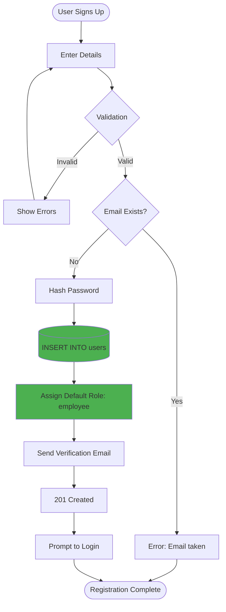

### User Login

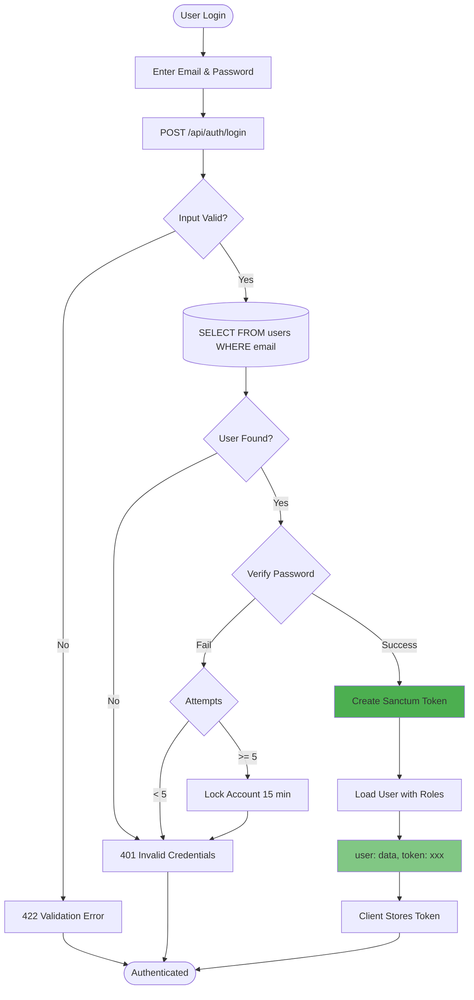

### Authenticated Request

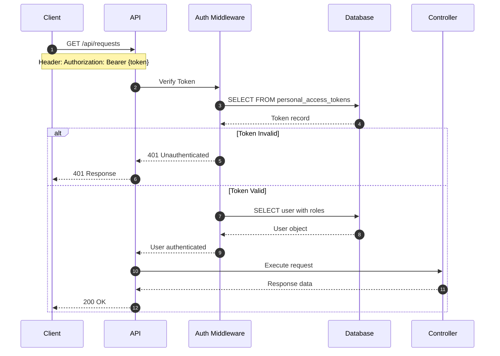

---

## 2. Role-Based Access Control

### Role Hierarchy

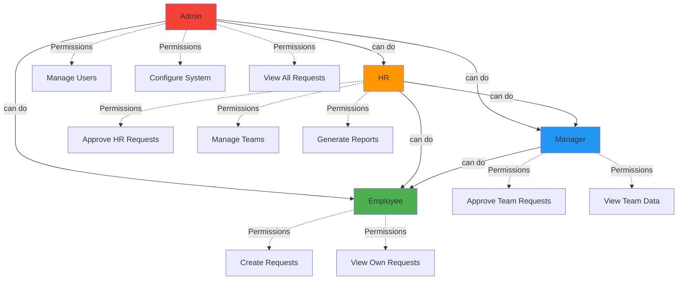

### Role Assignment Flow

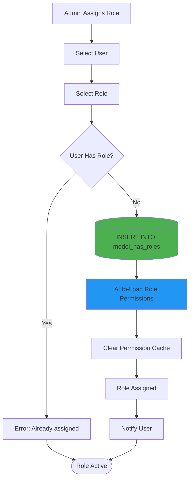

---

## 3. Permission Verification

### Request Authorization Check

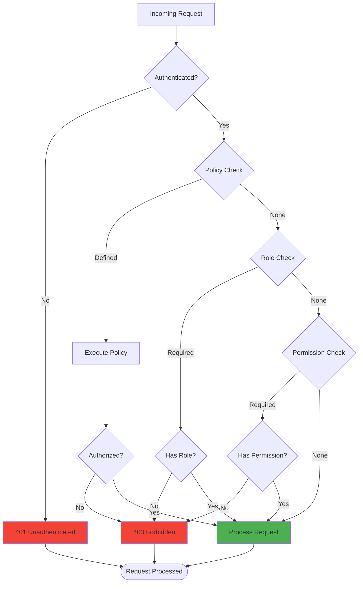

### Policy Evaluation

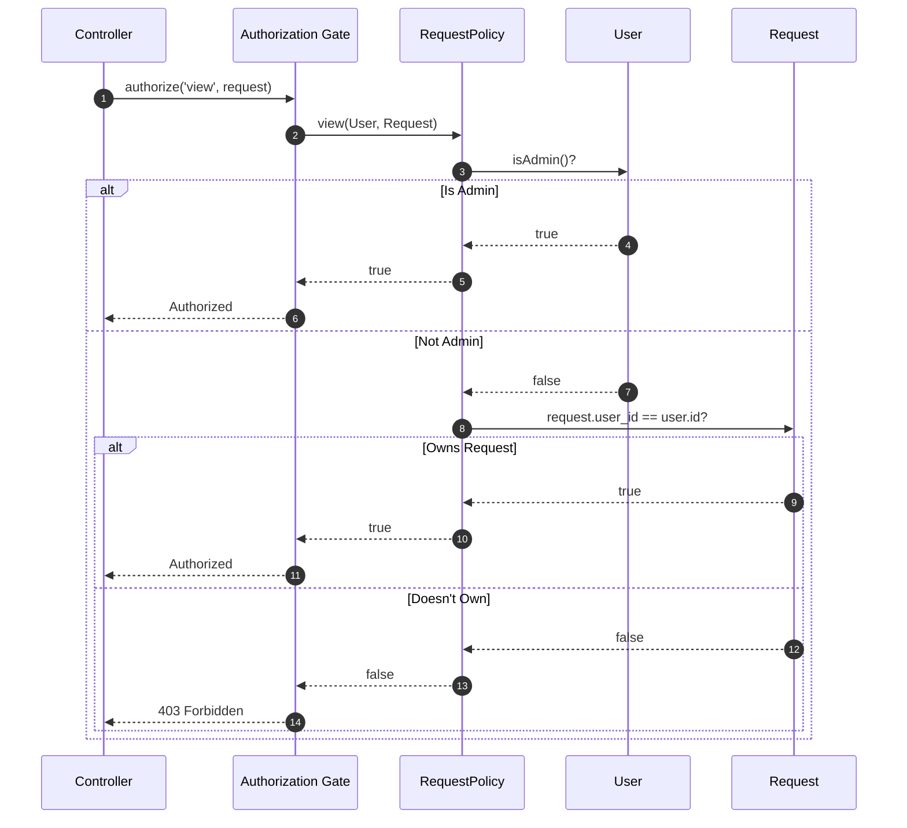

### Approval Authorization

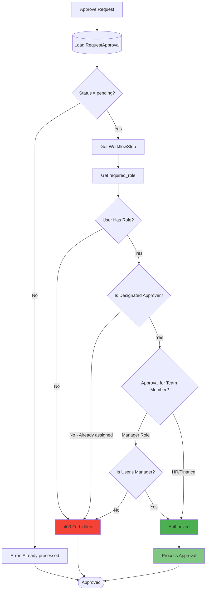

---

## 4. API Token Management

### Token Creation

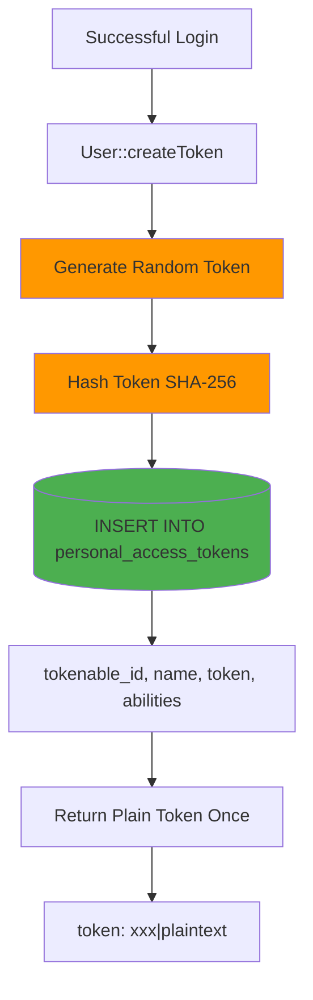

### Token Verification

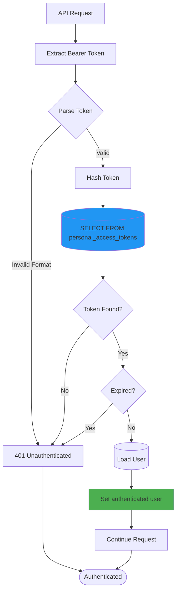

### Token Revocation

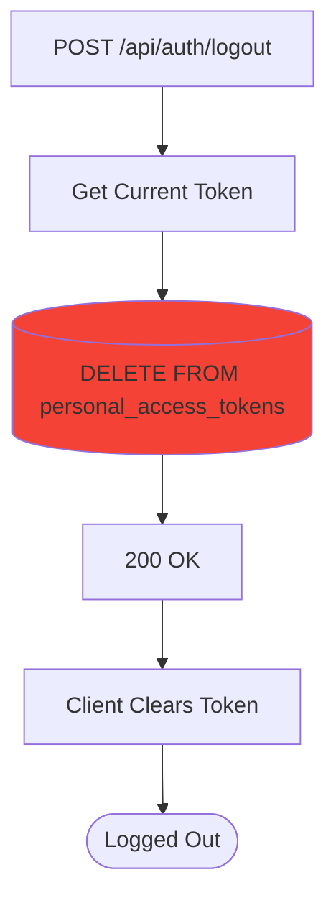

---

## 5. Security Patterns

### Multi-Layer Security

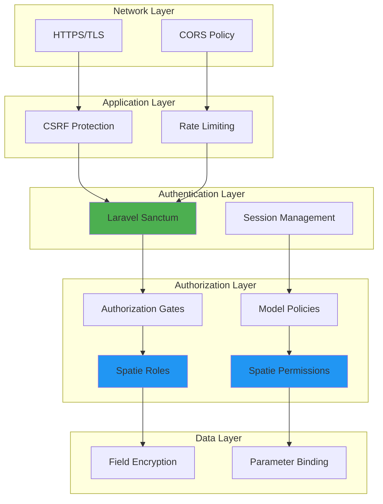

### Password Security

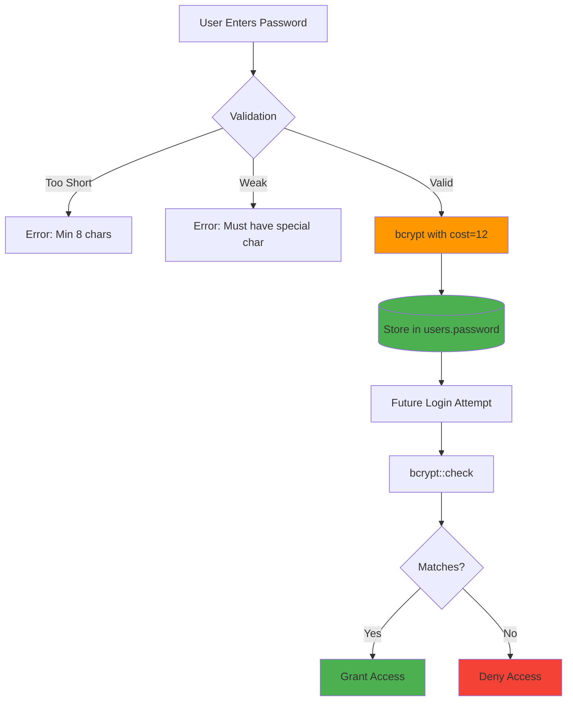

### XSS & SQL Injection Prevention

| Attack Vector | Prevention |
|--------------|-----------|
| **SQL Injection** | Eloquent ORM with parameter binding |
| **XSS** | Blade template auto-escaping |
| **CSRF** | Token verification on mutations |
| **Mass Assignment** | `$fillable` / `$guarded` in models |
| **Insecure Deserialization** | Queue job signature verification |

---

## Authorization Matrix

### Role Permissions

| Action | Admin | HR | Manager | Employee |
|--------|-------|-----|---------|----------|
| **Create Request** | ✅ | ✅ | ✅ | ✅ |
| **View Own Requests** | ✅ | ✅ | ✅ | ✅ |
| **View All Requests** | ✅ | ✅ | ❌ | ❌ |
| **View Team Requests** | ✅ | ✅ | ✅ | ❌ |
| **Approve as Manager** | ❌ | ❌ | ✅ | ❌ |
| **Approve as HR** | ❌ | ✅ | ❌ | ❌ |
| **Configure Workflows** | ✅ | ❌ | ❌ | ❌ |
| **Manage Users** | ✅ | ✅ | ❌ | ❌ |
| **Manage Teams** | ✅ | ✅ | ❌ | ❌ |
| **View Horizon** | ✅ | ❌ | ❌ | ❌ |
| **View Telescope** | ✅ | ❌ | ❌ | ❌ |

---

## Security Best Practices

### Implemented Measures

1. **Authentication**
   - Sanctum token-based auth
   - Bcrypt password hashing (cost 12)
   - Account lockout after 5 failed attempts

2. **Authorization**
   - Policy-based access control
   - Role-based permissions (Spatie)
   - Owner-based resource access

3. **Data Protection**
   - HTTPS enforced
   - Sensitive data encrypted at rest
   - SQL injection prevention via ORM

4. **Session Security**
   - HTTP-only cookies
   - CSRF token validation
   - Session expiration (120 min)

5. **API Security**
   - Rate limiting (60 req/min)
   - CORS whitelist
   - Token expiration (optional)

---

## Conclusion

FlowManager's authentication and authorization system ensures:

- ✅ **Secure Authentication** - Token-based with password hashing
- ✅ **Granular Authorization** - Role and policy-based access
- ✅ **Defense in Depth** - Multiple security layers
- ✅ **Audit Trail** - All auth events logged via Telescope
- ✅ **Standards Compliance** - OWASP best practices
