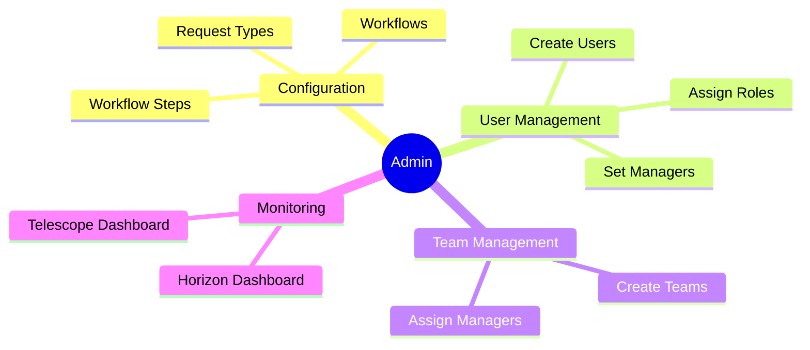
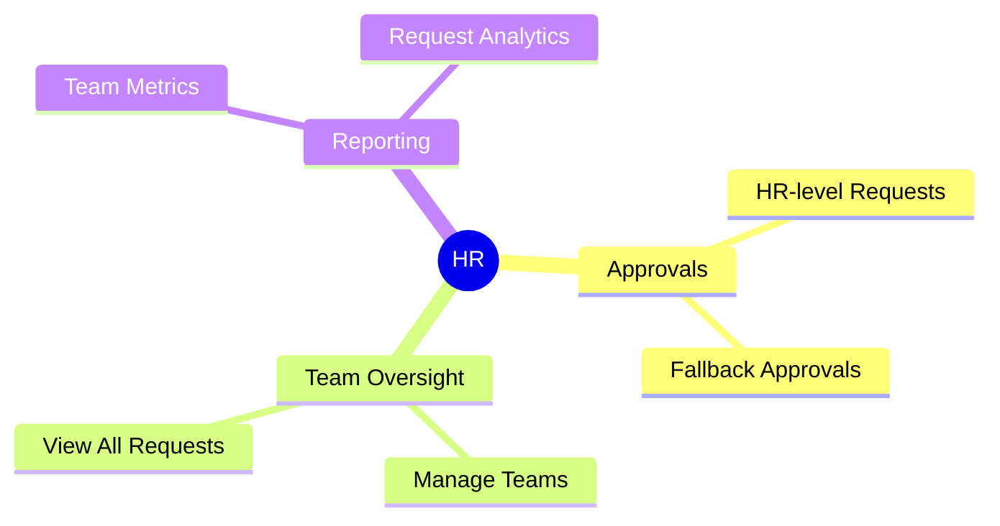
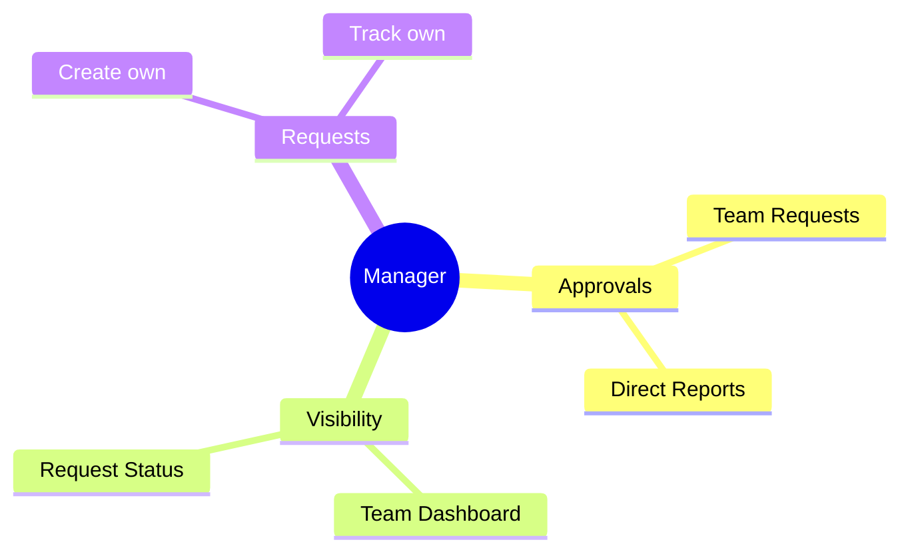
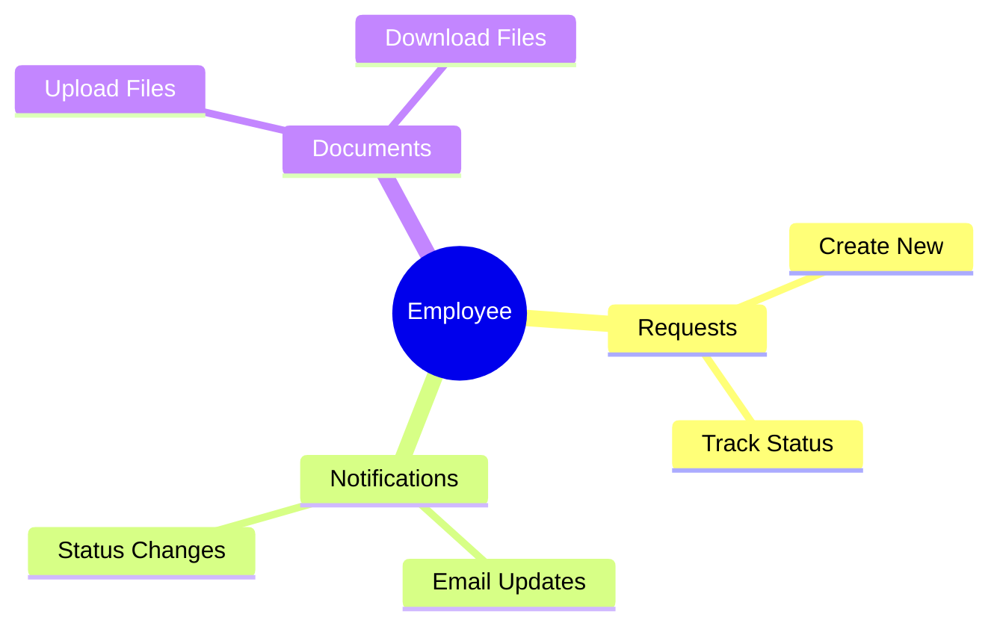
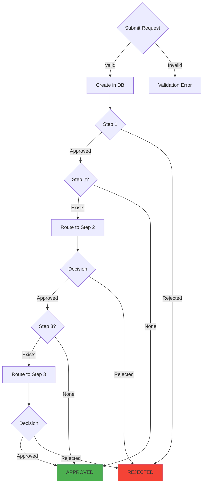
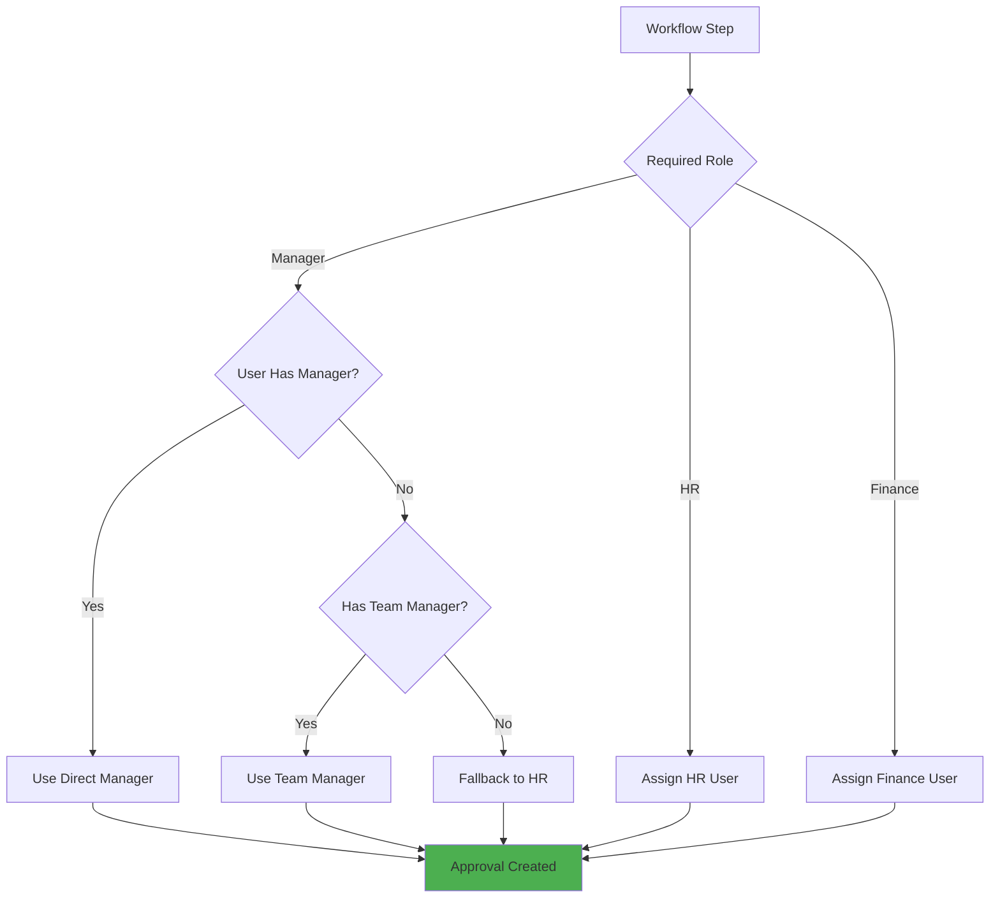
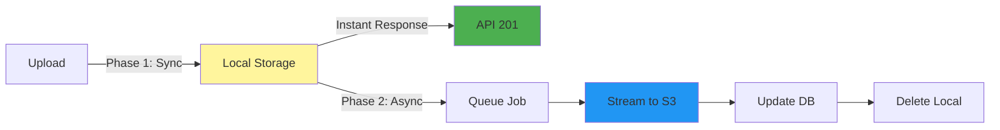
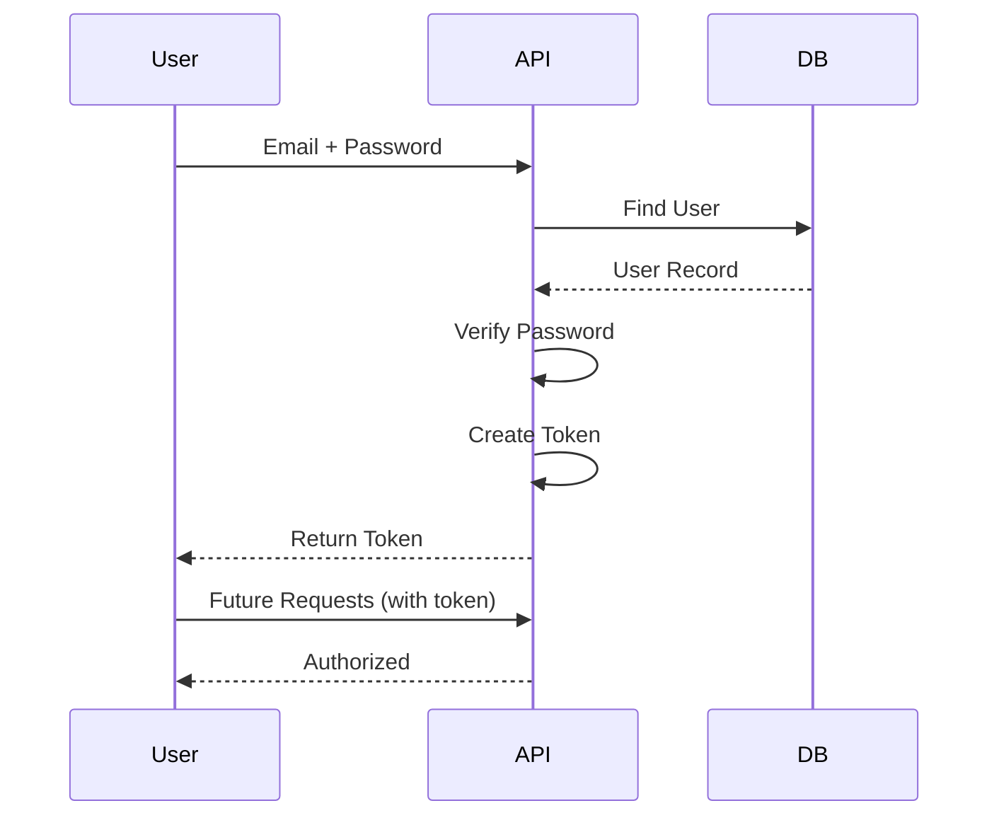
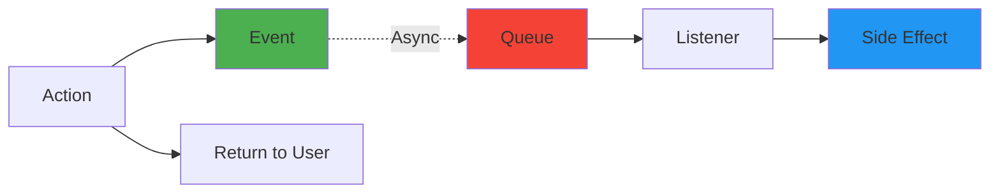

# Key Flows Summary - FlowManager

Quick reference guide with condensed flow summaries and decision trees for rapid understanding of FlowManager's core processes.

---

## Quick Navigation

| Flow Type | Key Question | Quick Answer |
|-----------|-------------|--------------|
| **User Journey** | How does each role interact? | [Role Flows](#role-quick-reference) |
| **Request Creation** | How are requests submitted? | [Request Flow](#request-lifecycle-summary) |
| **Approval Process** | How do approvals work? | [Approval Flow](#approval-process-summary) |
| **Document Upload** | How are files handled? | [Document Flow](#document-upload-summary) |
| **Authentication** | How do users log in? | [Auth Flow](#authentication-summary) |
| **Data Movement** | Where does data go? | [Data Flow](#data-flow-summary) |

---

## Role Quick Reference

### Admin Capabilities



### HR Capabilities



### Manager Capabilities



### Employee Capabilities



---

## Request Lifecycle Summary

### Visual Timeline

```mermaid
gantt
    title Request Lifecycle
    dateFormat  s
    section Creation
    User Submits       :0, 1s
    Validation         :1, 1s
    DB Write           :2, 1s
    Event Dispatch     :3, 1s
    section Approval Step 1
    Manager Reviews    :4, 10s
    Manager Approves   :14, 1s
    Route to Next      :15, 1s
    section Approval Step 2
    HR Reviews         :16, 10s
    HR Approves        :26, 1s
    Route to Next      :27, 1s
    section Finance
    Finance Reviews    :28, 10s
    Finance Approves   :38, 1s
    section Complete
    Mark Approved      :39, 1s
    Notify Requester   :40, 1s
```



### Decision Tree



---

## Approval Process Summary

### Approver Selection Logic



### Approval States

| State | Meaning | Next Action |
|-------|---------|-------------|
| **pending** | Awaiting approver decision | Approver must review |
| **approved** | Approver accepted | Route to next step or complete |
| **rejected** | Approver denied | Workflow terminates |

---

## Document Upload Summary

### Two-Phase Process



### Why Two Phases?

1. **Speed** - Local writes are instant (~50ms)
2. **UX** - User gets immediate response
3. **Reliability** - S3 won't block request
4. **Scalability** - Workers handle S3 separately

---

## Authentication Summary

### Login Flow (Simplified)



### Authorization Check

```
1. Request arrives with token
2. Sanctum verifies token
3. Load User + Roles + Permissions
4. Check Policy/Gate
5. Allow or Deny (403)
```

---

## Data Flow Summary

### Read Operations

```
Client → Routes → Middleware → Controller → Model → Database
                                    ↓
                                Resource (Transform)
                                    ↓
                                Client ← JSON Response
```

### Write Operations

```
Client → Routes → Middleware → Controller → Service → WorkflowEngine
                                                          ↓
                                                    BEGIN TRANSACTION
                                                          ↓
                                                    Model → Database
                                                          ↓
                                                    COMMIT TRANSACTION
                                                          ↓
                                                    Fire Events (Async)
```

---

## Event-Driven Architecture Summary

### Core Pattern



### Events → Listeners Mapping

| Event | Listener | Action |
|-------|----------|--------|
| **RequestCreated** | SendRequestCreatedNotification | Email approver |
| **RequestApproved** | SendRequestApprovedNotification | Email requester |
| **RequestRejected** | SendRequestRejectedNotification | Email requester |
| **DocumentsUploaded** | UploadDocumentsToS3 | Upload to S3 |

---

## Common Scenarios

### Scenario 1: Employee Submits Leave Request

```
1. Employee fills form (client-side)
2. POST /api/requests with JSON payload
3. Server validates and creates Request
4. WorkflowEngine finds manager
5. Creates pending RequestApproval for manager
6. Fires RequestCreated event
7. Returns 201 to employee (instant)
8. Queue worker emails manager
9. Manager receives email notification
```

### Scenario 2: Manager Approves Request

```
1. Manager clicks approval link
2. POST /api/requests/:id/action {"action": "approve"}
3. Server validates manager has authority
4. Updates RequestApproval to approved
5. Checks for next step (e.g., HR)
6. Creates new RequestApproval for HR
7. Fires RequestApproved event
8. Returns 200 to manager
9. Queue worker emails HR and requester
```

### Scenario 3: Multi-File Upload

```
1. Employee attaches 3 PDFs to request
2. Server stores files in storage/app/temp-uploads
3. Returns 201 immediately
4. DocumentsUploaded event fires
5. Queue worker picks up job
6. Streams file 1 to S3, creates DB record, deletes local
7. Streams file 2 to S3, creates DB record, deletes local
8. Streams file 3 to S3, creates DB record, deletes local
9. All documents available in S3
```

---

## Performance Targets

| Operation | Target Time |
|-----------|-------------|
| **Request Creation** | < 500ms |
| **Approval Processing** | < 300ms |
| **File Upload (local)** | < 100ms |
| **API Authentication** | < 50ms |
| **Email Delivery** | < 30s (async) |
| **S3 Upload** | < 60s per file (async) |

---

## Error Handling Patterns

### Validation Errors (422)

```json
{
  "message": "The given data was invalid.",
  "errors": {
    "payload.start_date": ["The start date field is required."]
  }
}
```

### Authorization Errors (403)

```json
{
  "message": "This action is unauthorized."
}
```

### Not Found (404)

```json
{
  "message": "Request not found."
}
```

---

## Monitoring Quick Reference

### Horizon Dashboard

- **URL**: `/horizon`
- **Purpose**: Queue monitoring
- **Key Metrics**:
  - Jobs per minute
  - Failed jobs
  - Queue wait times

### Telescope Dashboard

- **URL**: `/telescope`
- **Purpose**: Application debugging
- **Key Tabs**:
  - Requests (HTTP)
  - Queries (Database)
  - Jobs (Queue)
  - Mail (Emails)
  - Exceptions (Errors)

---

## Integration Points

### External Services

| Service | Purpose | Integration Method |
|---------|---------|-------------------|
| **AWS S3** | Document storage | Laravel Storage facade |
| **SMTP Server** | Email delivery | Laravel Mail facade |
| **Redis** | Cache & Queue | Laravel Cache/Queue |
| **PostgreSQL** | Primary database | Eloquent ORM |

---

## Key Takeaways

### Architecture Principles

1. **Event-Driven** - Side effects are asynchronous
2. **Service Layer** - Business logic isolated from controllers
3. **Policy-Based** - Authorization via policies and gates
4. **Queue-Based** - Background jobs for slow operations
5. **Transaction-Safe** - Critical operations use DB transactions

### Workflow Characteristics

- **Configurable** - Admin defines approval steps
- **Hierarchical** - Respects org structure
- **Fallback-Safe** - HR serves as backup approver
- **Auditable** - Complete approval history
- **Event-Driven** - Notifications and uploads deferred

### Security Layers

1. **Network** - HTTPS/TLS
2. **Application** - CSRF, Rate Limiting
3. **Authentication** - Laravel Sanctum tokens
4. **Authorization** - Roles, Permissions, Policies
5. **Data** - Encryption, Query Binding

---

## Decision Cheat Sheet

### "Which approver gets assigned?"

1. Check required role for step
2. If Manager: User's manager → Team manager → HR
3. If HR/Finance: Find user with that role
4. Create approval with approver_id

### "When does a request complete?"

1. All workflow steps approved? → Status = 'approved'
2. Any step rejected? → Status = 'rejected'
3. Otherwise → Status = 'pending'

### "How are documents uploaded?"

1. Store locally first
2. Return API response immediately
3. Queue job to stream to S3
4. Update database with S3 path
5. Delete local copy

### "Who can view a request?"

- **Owner** - Always
- **Admin** - Always
- **HR** - Always
- **Current Approver** - If pending at their step
- **Manager** - If requester is on their team
- **Others** - No

---

## Conclusion

FlowManager is designed with these core principles:

✅ **Async-First** - Non-blocking user experience  
✅ **Event-Driven** - Decoupled components  
✅ **Role-Based** - Granular access control  
✅ **Observable** - Comprehensive monitoring  
✅ **Scalable** - Horizontal scaling ready  
✅ **Secure** - Multi-layer protection

For detailed flows, see the individual documentation files linked at the top of this summary.
